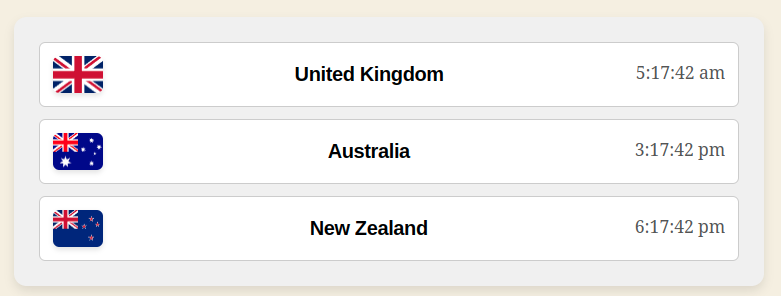

# World Clock Widget

A modern, responsive React widget that showcases the current time for multiple locations, complete with country flags and smooth animations. Designed with Flexbox for a clean and adaptable layout.
World Clock Widget

A responsive React-based widget that displays the current time for multiple locations (United Kingdom, Australia, and New Zealand) with their respective flags. The widget uses Flexbox for layout and includes animations for a smooth fade-in effect.

## Features

- Displays the current time for:
  - United Kingdom
  - Australia
  - New Zealand
- Flags for each country with rounded corners.
- Responsive design that adapts to different screen sizes.
- Smooth fade-in animation for flags with customizable delays.
- Prevents content overflow and ensures a clean layout.

## Technologies Used

- **React**: For building the user interface.
- **CSS**: For styling and animations.
- **Flexbox**: For responsive layout management.

## Installation

1. Clone the repository:
```bash
   git clone https://github.com/bibble235/world-clock-widget.git
   cd world-clock-widget
```

2. Install Dependencies
```bash 
    npm install
```

3. Start the development server:
```bash
    npm start
```

4. Open the browser and visit `http://localhost:3000/` to view the widget.

File Structure
```   
 src/
 ├── App.js          # Main application component
 ├── App.css         # Global styles
 ├── WorldClock.js   # World Clock component
 ├── index.js        # Entry point for React
```

## usage

Once the widget is integrated into your WordPress theme:

1. Navigate to the WordPress block editor.
2. Add the widget to your page or post.
3. The World Clock Widget will display the current time for the configured locations.

## Demo



# License
This project is licensed under the MIT License - see the [LICENSE](LICENSE) file for details.


